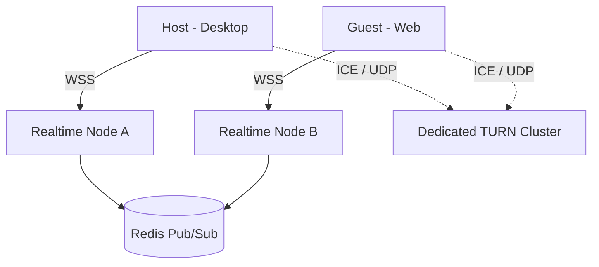

# WebRTC DISTRIBUTED ARCHITECTURE

## Overview
To support 10,000 concurrent realtime sessions, the WebRTC signaling layer is fully decoupled from media transport and AI processing. The `services/realtime` module handles stateless WebSocket connections, utilizing Redis for distributed state.

## Topology

## Key Principles
1. **Stateless Nodes**: No connection state is stored exclusively in Node.js process memory.
2. **Media Separation**: Audio/Screen streams flow directly peer-to-peer or via TURN; they DO NOT route through the Node.js/Python API backend.
3. **Connection Draining**: Realtime nodes support graceful shutdown (SIGTERM) by sending reconnect advisories to clients.
