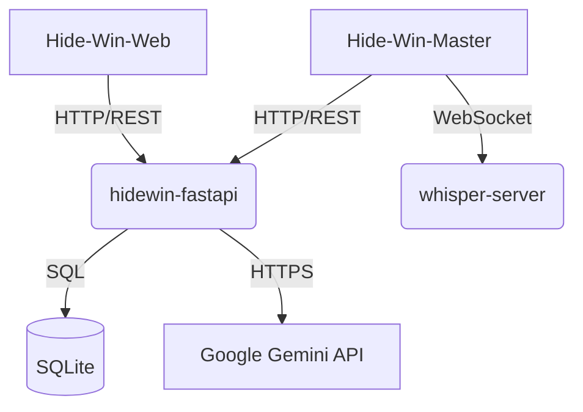

# CURRENT DEPENDENCY GRAPH

```mermaid
graph TD
    A[Hide-Win-Master] -->|HTTP/REST| B(hidewin-fastapi)
    A -->|WebSocket| D(whisper-server)
    
    E[Hide-Win-Web] -->|HTTP/REST| B
    B -->|SQL| F[(SQLite)]
    B -->|HTTPS| G[Google Gemini API]
```
