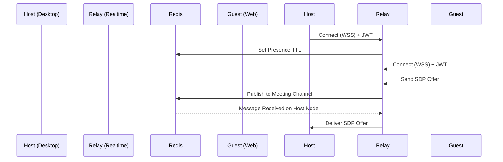

# DATA FLOW

## WebRTC Signaling & AI Processing Flow

```mermaid
sequenceDiagram
    participant Host (Desktop)
    participant Relay (Realtime)
    participant Redis
    participant Guest (Web)
    
    Host->>Relay: Connect (WSS) + JWT
    Relay->>Redis: Set Presence TTL
    Guest->>Relay: Connect (WSS) + JWT
    Guest->>Relay: Send SDP Offer
    Relay->>Redis: Publish to Meeting Channel
    Redis-->>Relay: Message Received on Host Node
    Relay->>Host: Deliver SDP Offer
```
