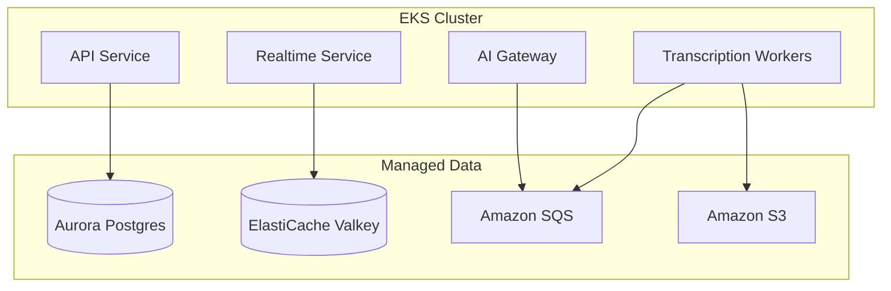

# DEPENDENCY GRAPH

```mermaid
graph TD
    subgraph EKS Cluster
        API[API Service]
        RT[Realtime Service]
        AIG[AI Gateway]
        Worker[Transcription Workers]
    end
    
    subgraph Managed Data
        DB[(Aurora Postgres)]
        Cache[(ElastiCache Valkey)]
        MQ[Amazon SQS]
        Storage[Amazon S3]
    end
    
    API --> DB
    RT --> Cache
    AIG --> MQ
    Worker --> MQ
    Worker --> Storage
```
