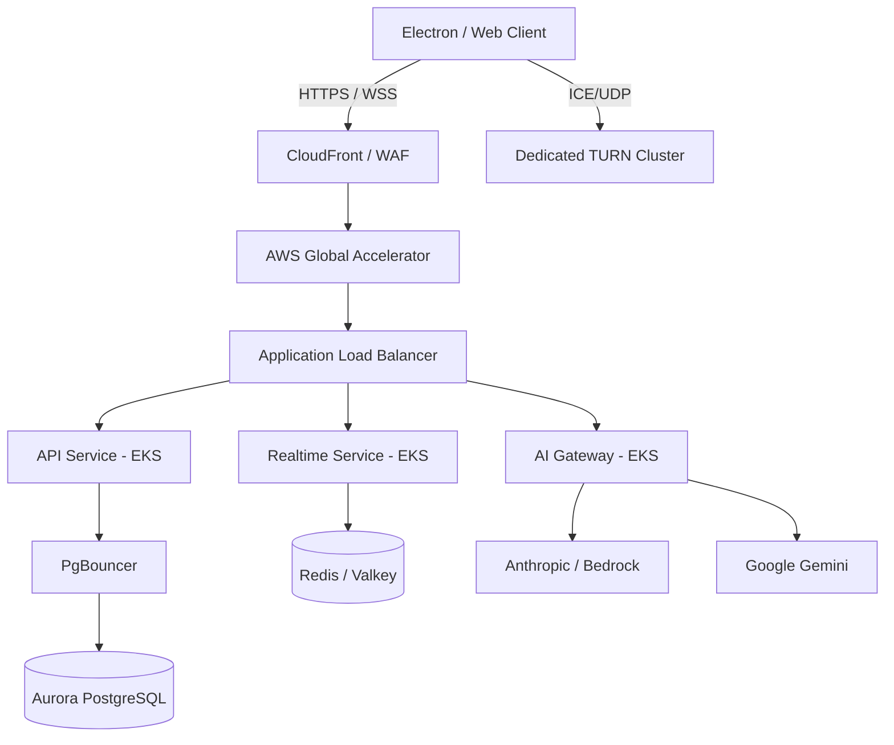

# HIGH LEVEL DESIGN

## Topology

## Core Services

### 1. API Service (hidewin-fastapi)
- **Responsibility**: Core business logic, meeting lifecycle, auth.
- **Scaling Strategy**: HPA on CPU (60%) and Request Latency.
- **State**: Stateless.

### 2. Realtime Service (hidewin-cloud-relay)
- **Responsibility**: WebRTC signaling, presence, pub/sub.
- **Scaling Strategy**: HPA on active connections.
- **State**: Externalized to Redis.

### 3. AI Gateway
- **Responsibility**: Model routing, streaming, circuit breaking, prompt assembly.
- **Scaling Strategy**: HPA on queue depth and TTFT.
- **State**: Stateless.
