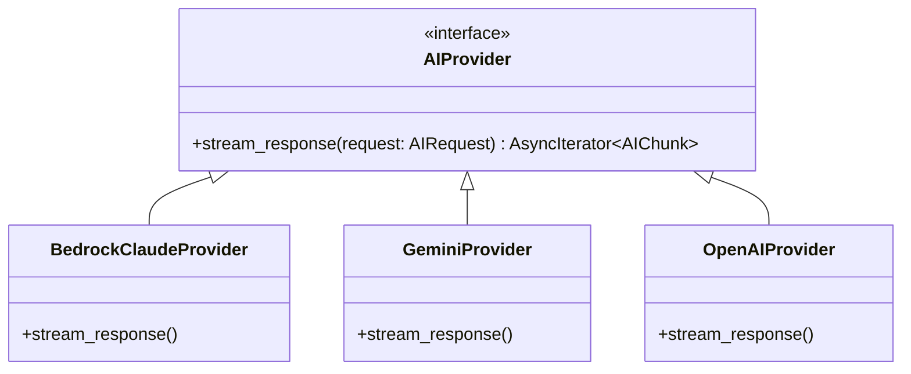

# LOW LEVEL DESIGN: AI GATEWAY & REALTIME

## AI Provider Abstraction

## WebRTC Distributed State (Redis)
- **Key Naming**: `session:{meeting_id}:participants` (Set), `presence:{user_id}` (String/TTL)
- **Pub/Sub**: Channel `meeting:{meeting_id}:events` routes signaling messages across multiple Node.js instances.
- **Eviction Policy**: Volatile-TTL.
